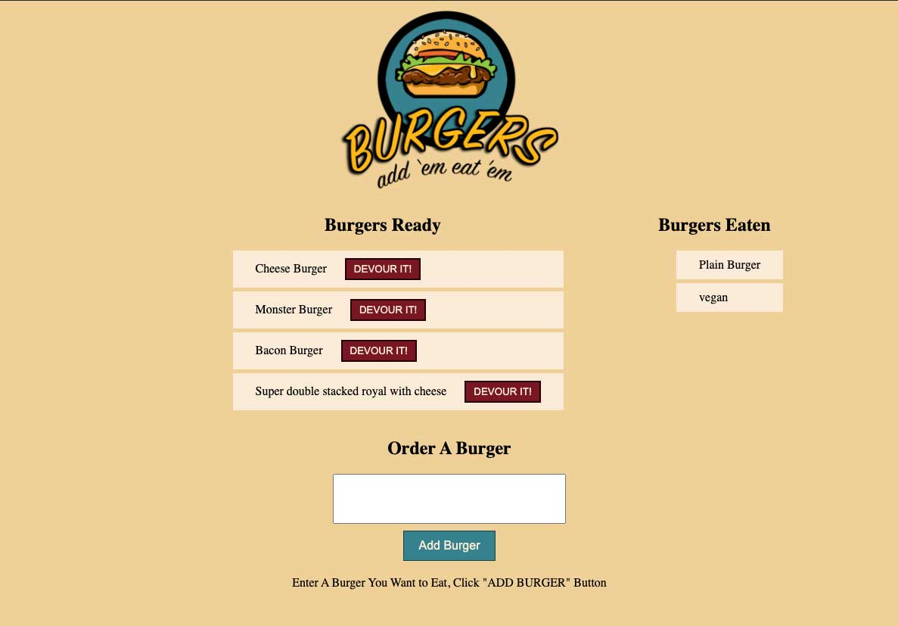

# Paul's Eat-A-Burger Application

This application creates a burger logger with MySQL, Node, Express, Handlebars and a homemade ORM (yum!). It follows the MVC design pattern; uses Node and MySQL to query and route data in the app, and Handlebars to generate HTML. The result is a tasty bit of burger code to make your mouth water.

## Instructions

- Copy files from github and run npm install to get the proper modules.
- Run the server.js file from terminal to run the code.
- Or simply go to my link below to fill your belly 

## GitHub Code 

The code is set up with MVC but here is the basic structure:

- server.js runs the show, use this to launch the application
- config contains the connection and the yummy orm
- controllers contains the burger router controls, this sets up all the communication.
- public/views is what the user or the view
- don't forget to run npm install
- Happy burger eating!

## Application Link

View the application and get a full belly:

[application](https://paulseatburgers.herokuapp.com/)

